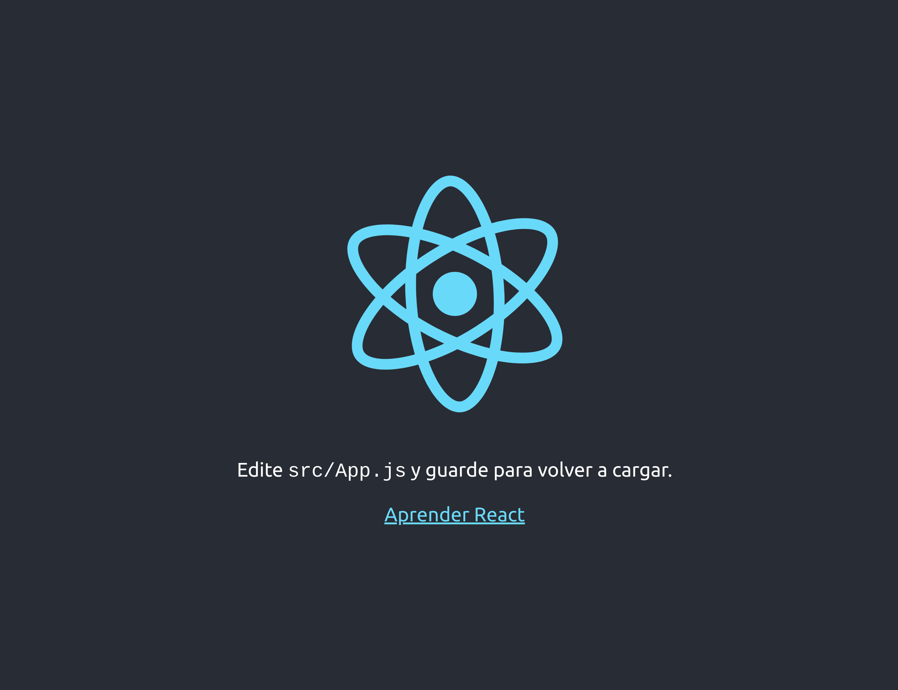

# react-18next-example


This is an example repository showing how to use Localazy with react-18next for localization management.
To learn more, check out the [blog post](https://localazy.com/blog/how-to-localize-react-app-with-react-18next-and-localazy) describing the set up in detail.

## Sandbox
https://codesandbox.io/s/misty-thunder-phjq0

## Testing out this repo
This repository contains translations from an actual [Localazy React i18next example](https://localazy.com/p/react-i18next-example) app. You can try to run `localazy download` to see how it works. However, this app is in read-only mode, meaning that `localazy upload` will fail. 

First install dependencies
```
npm install
```

and then run the application
```
npm run start
```

## Adjusting for your own project

- sign up for [Localazy](https://localazy.com/register),
- [create an app](https://localazy.com/my/create). Although English is recommended, you may use any language as source 
- select *React* integration option and install Localazy [CLI](https://testing.localazy.com/docs/cli/installation),
- Retrieve your _writeKey_ and _readKey_ from the integration guide page and change them in `localazy.keys.json`,
- it is recommended to add `localazy.keys.json` to _.gitignore_
- remove every locale file except for your source locale (presumably en.json)
- fill in your source phrases,
- run `localazy upload`,
- when you have accepted strings in other languages, run `localazy download` and check locales folder for the new translations,
-  run the app `npm run start`
